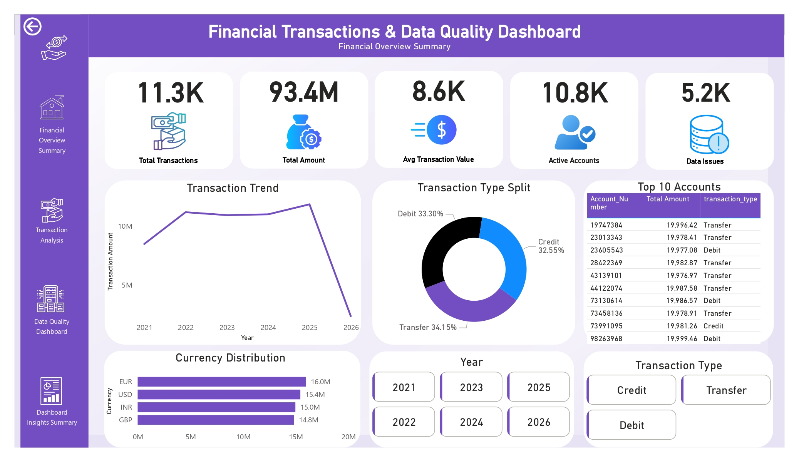
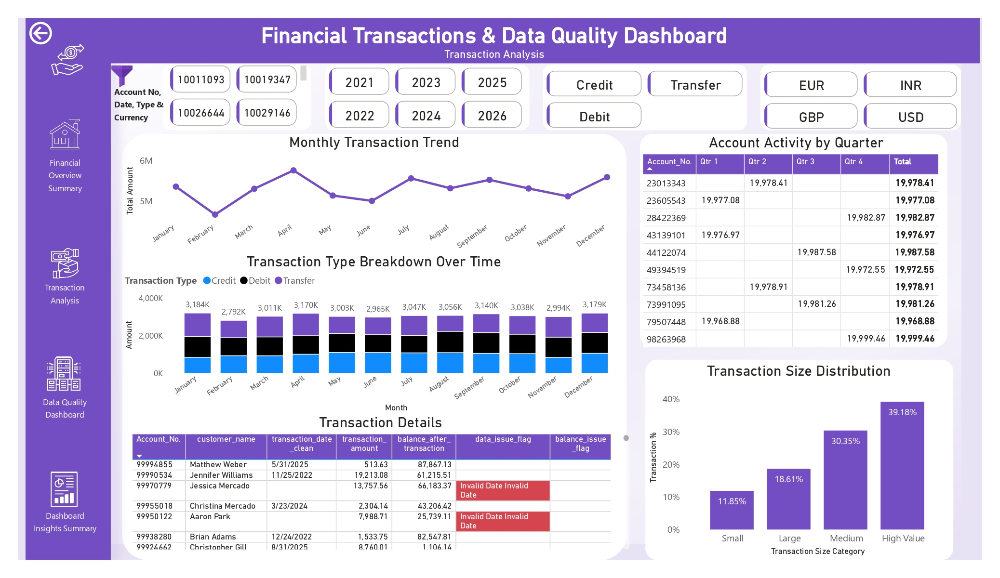
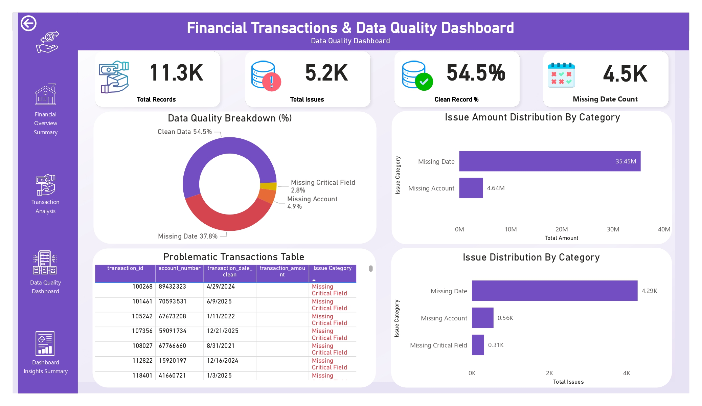
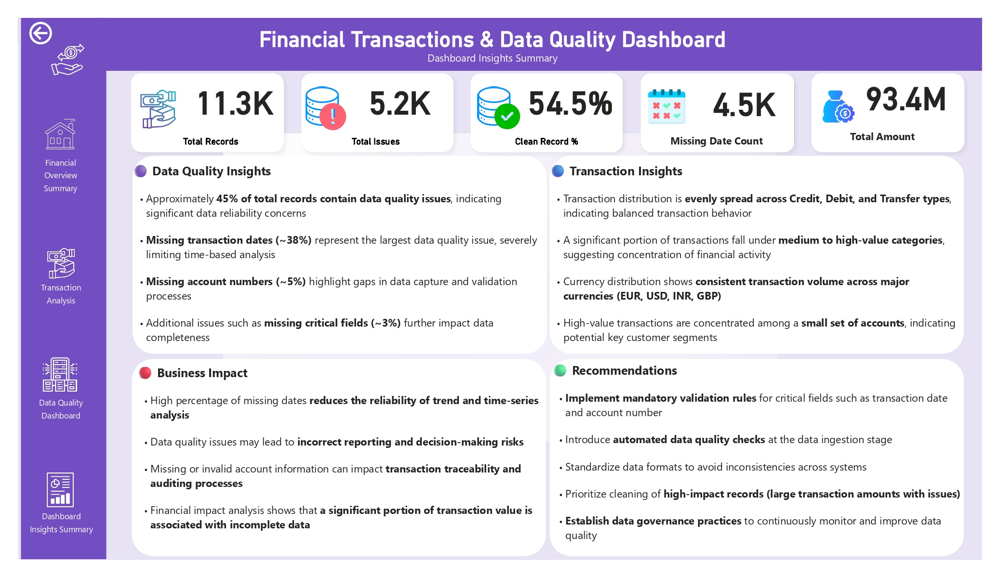

# 📊 Financial Transactions & Data Quality Dashboard

## 📌 Project Overview

This project presents an interactive Power BI dashboard focused on analyzing financial transactions along with identifying and monitoring data quality issues.

The dashboard not only provides business insights but also highlights critical data reliability problems such as missing dates, invalid account numbers, and incomplete records.

---

## 🖼 Dashboard Preview

### 🔹 Executive Overview

### 🔹 Transaction Analysis

### 🔹 Data Quality Dashboard

### 🔹 Insights Summary

---

## 🔑 Key Features

- Analysis of **11K+ financial transaction records**
- Identification of **5K+ data quality issues**
- Data cleaning and transformation of messy datasets
- Detection of:
  - Missing transaction dates (~38%)
  - Missing account numbers (~5%)
  - Missing critical fields
- Interactive dashboards with **drill-through functionality**
- Financial impact analysis of data issues
- Custom **DAX-based issue classification**

---

## 📊 Dashboard Pages

### 1. Executive Overview
- High-level KPIs and transaction summary
- Monthly transaction trends
- Currency and transaction type distribution

---

### 2. Transaction Analysis
- Transaction type breakdown (Credit, Debit, Transfer)
- Transaction size distribution (Small, Medium, Large)
- Account-level performance
- Drill-through for detailed transaction analysis

---

### 3. Data Quality Dashboard
- Clean vs Issue data comparison
- Issue type breakdown
- Identification of problematic records
- Financial impact of data issues

---

### 4. Insights Summary
- Consolidated key findings
- Business impact analysis
- Data quality recommendations

---

## 💡 Key Insights

- ~45% of records contain data quality issues  
- Missing transaction dates (~38%) are the most critical issue  
- Missing account numbers (~5%) affect traceability  
- Data quality issues significantly impact time-based analysis  
- A portion of high-value transactions is associated with incomplete data  

---

## 🛠 Tools & Technologies

- Power BI  
- SQL  
- DAX  
- Power Query  
- Data Cleaning & Transformation  

---

## 📂 Project Structure
